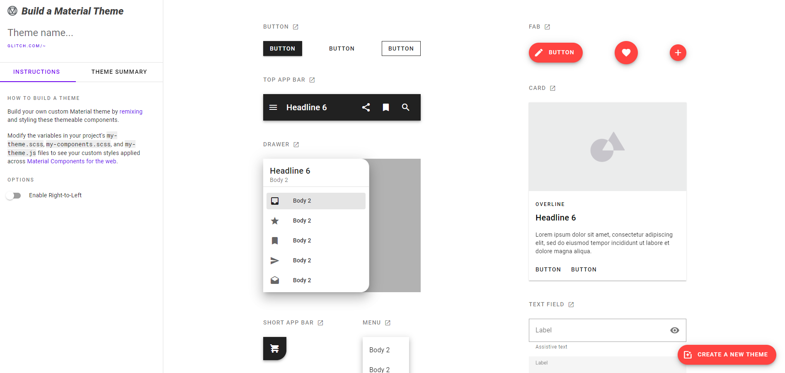

# Build a Material theme



## Change values for typography, shape, and color
To begin customizing your theme, you’ll modify the variables in your project’s ```my-theme.scss``` file. By default, each theme starts off with Material’s baseline values. We’ve added these values in the theme so you can easily swap them out.

### Typography
To change your theme’s typography, we recommend using <a href="https://fonts.google.com/" target="_blank">Google Fonts</a> and choosing a font-family that best reflects your style. Copy the font’s @import url and set the global font-family.

```
@import url('https://fonts.googleapis.com/css?family=Roboto:300,400,500');
$mdc-typography-font-family: unquote("Roboto, sans-serif");
```

### Shape
To systematically apply shape throughout your app, it helps to understand that components are grouped by size into categories of small, medium, and large. Each component size group can be themed by overriding the default values. We recommend using our <a href="https://material.io/design/shape/about-shape.html#shape-customization-tool" target="_blank">shape customization tool</a> to help you pick your radius values.

```
$mdc-shape-small-component-radius: 4px;
$mdc-shape-medium-component-radius: 4px;
$mdc-shape-large-component-radius: 0px;
```

### Color
To change your theme's color scheme, replace the default HEX color values with custom HEX color values. Use our <a href="https://material.io/design/color/the-color-system.html#tools-for-picking-colors" target="_blank">color palette generator</a>  to help come up with pairings and check your color contrast.

Primary colors ```$mdc-theme-primary``` map to components and elements, while secondary colors  ```$mdc-theme-secondary``` are used as accents on components.

```
$mdc-theme-primary: #6200ee;
$mdc-theme-secondary: #018786;
```

Theme background ```$mdc-theme-background``` appears behind scrollable content. Surface color ```$mdc-theme-surface``` is mapped to the surface of components such as cards, sheets, and menus. Error color ```$mdc-theme-error``` is used to indicate an error state for components such as text fields.

```
$mdc-theme-surface: #ffffff;
$mdc-theme-background: #ffffff;
$mdc-theme-error: #b00020;
```

"On" colors define how text, icons, and strokes are colored in relation to the surface on which they appear.

```
$mdc-theme-on-primary: #ffffff;
$mdc-theme-on-secondary: #ffffff;
$mdc-theme-on-error: #ffffff;
$mdc-theme-on-surface: #000000;
```

Modifying these variables in your project's ```my-theme.scss``` file creates your custom Material theme.

## Creation
write in the terminal (it is necessary to install yarn, https://yarnpkg.com/lang/en/docs/install/)
```
yarn install
yarn build
```
three files will be created in the dist folder: bundle.js, bundle.js and index.html
Congrats!, your theme is ready to be used.

## Interested in learning more?
Check out the [Material Components for the Web](https://github.com/material-components/material-components-web) documentation to add more components and styling. Read the full [Getting Started guide](https://github.com/material-components/material-components-web/blob/master/docs/getting-started.md) and learn about [Material Theming](https://material.io/design/material-theming).
